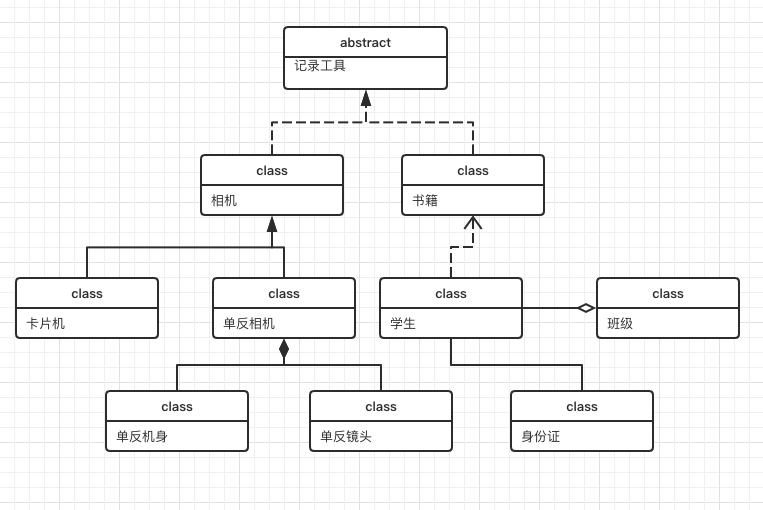

# 设计模式

摘引自[图解设计模式](https://design-patterns.readthedocs.io/zh_CN/latest/index.html)

## 类之间的关系

### 继承关系（is-a）
1. *泛化（Generalization）*

    例如单反相机属于相机。

2. *实现（realize）*

    例如相机是记录工具（抽象类）的实现，相机实现了记录工具。

3. *聚合关系（aggregation）*

    聚合关系用于实体对象之间，表示整体由部分构成的语义，部分不强依赖于整体，例如一个NBA球队和球里的球员。

4. *组合关系（composition）*

    部分强依赖于整体，整体不存在了，部分也就不存在了，例如NBA和各个球队的关系，nba停摆了或者倒闭了，各个球队也就停止运行或者不存在了。

5. *关联关系（association）*

    描述静态结构关系，天然的结构，是一种强依赖关系。例如纸和笔的关系；

6。 *依赖关系（dependency）*

  与关联关系的不同的是，依赖关系是一种临时性关系，是在运行时产生的，也是有可能变化的。值得注意的是，类之间的依赖关系应该是单向的。

UML例图：



## 创建者模式（Creational Pattern）

对类的实例化过程进行封装，能够将对象的创建和使用分离开，只需要知道共同使用的接口，而不需要具体的实现细节，使系统符合单一职责原则。

创建者模式通过隐藏对象如何创建和组合在一起使得系统独立。

### 简单工厂模式（静态工厂方法）

通过传入参数就可以得到想要的实例。

1. 专门定义一个工厂类来负责创建其他类的实例；
2. 通常被创建的类都有共同的父类；

简单工厂类的三个角色：

1. Factory
2. Product
3. ConcreteProduct

```java
class Camera {

}

class DSLRCamera extends Camera {
    DSLRCamera() {

    }
    
}

class MirrorLessCamera extends Camera {
    DSLRCamera() {

    }
    
}

public class CameraFactory {
    public static createCamera(String type) {
        if ("mirrorless".equals(type)) {
            return new MirrorLessCamera();
        } else ("DSLRCamera".equals(type)) {
            return new DSLRCamera();
        } else {
            throw "coming soon...";
        }
    }
}


```

优点：
 
 * 责任的分治，创建与业务分离；
 * 创建者只需要传入相对应的参数即可得到实例；

缺点：
 
 * 集中了创建逻辑，出现问题会影响所有类；
 * 添加新产品需要更改工厂类，如果产品类型过多会使工厂逻辑过于复杂；
 * 静态工厂方法，无法继承；

 ### 工厂方法模式（Factory Method Pattern）

 对简单工厂模式中的工厂类进行抽象，更加符合开闭原则；

 4个角色：
 1. 抽象产品；
 2. 抽象工厂；
 3. 工厂；
 4. 产品；

 实现：

```java
public abstract class Camera{
    public abstract void capture();
}

public abstract class CameraFactory{
    public abstract Camera createCamera();
}

public class MirrorLessCamera extends Camera {
    public capture() {
        System.out.println("cheese!");
    }
}

public class DSLRCamera extends Camera {
    public capture() {
        System.out.println("mocha!");
    }
}

public class MirrorLessCameraFactory extends Camera {
    public MirrorLessCamera create() {
        return new MirrorLessCamera();
    }
}

public class DSLRCameraFactory extends Camera {
    public DSLRCamera create() {
        return new DSLRCamera();
    }
}
```

优点：
 * 隐藏创建细节；
 * 工厂可以自主确定产品对象；
 * 新产品只需要添加工厂，无需修改之前代码，符合开闭原则；

缺点：
 
 * 添加新产品类需要添加新的工厂类，类会成对增加，增加系统复杂度；
 * 抽象层的引入增加系统复杂度，可能需要反射；

### 抽象工厂模式（AbstractFactory）

和工厂方法不同的是工厂方法只负责生产一个产品层级的，而抽象工厂则是可以生产一个产品族；

4个角色：

1. 抽象工厂；
2. 工厂；
3. 抽象产品；
4. 产品；

看上去好像和工厂模式一样，其实解决的是不同的问题；

实例是两个品牌，Nikon和Canon，两个品牌的工厂，他们都是既可以生产单反相机也可以生产无反相机的品牌；

```java
public abstract class CameraFactory {
    public void createDSLRCamera();
    public void createMirrorLessCamera();
}

public abstract class Camera {
    public void capture();
}

public class DSLRCamera extends Camera{}
public class MirrorLessCamera extends Camera{}

public class CanonCameraFactory extends CameraFactory {
    ...
}
public class NikonCameraFactory extends CameraFactory {
    ...
}
```

优点：

 * 能够使系统能使用一个产品族的对象，不需要调用多个类；
 * 符合开闭原则；

缺点：
 
 * 添加产品时，所有工厂类都需要实现新产品的接口，会带来较大的不便；
 * 不完全的开闭原则则，产品族可以，产品不行；开闭原则的倾斜性。

 应用场景：软件主题。

 ### 建造者模式（builder pattern）

 可以将部件和其组装过程分开，一步一步构造一个复杂对象。

4个角色：
* 抽象建造者
* 具体建造者
* 指挥者
* 产品

```java
public abstract class Builder {
    public void setEngine();
    public void setWheels();
    public void setColor();
}

public class BuilderA extends Builder {
    public Product prod;
    public void setEngine() {
        this.prod.Engine = "V8";
    }
    public void setWheels() {
        this.prod.wheels = "Alum 18\"";
    };
    public void setColor() {
        this.prod.color = "red";
    };

    public Product getResult() {
        return this.prod;
    }
}

public class Director {
    public Builder builder;
    public void setBuilder(Builder builder) {
        this.builder = builder;
    }
    public Product construct() {
        builder.setEngine();
        builder.setWheels();
        builder.setColor();

        return builder.getResult();
    }
}
```

通过不同的builder产生不一样的产品，客户端只需要知道具体builder的类型；

优点：

* 产品本身和产品的创建过程解耦，相同创建过程建造不同的对象；
* 实现新的建造者就可以得到不同的产品对象；
* 更清晰的控制产品的创建过程；
* 符合开闭原则

缺点：

* 使用范围不大，适合用在产品结构相似的情况下；
* 内部变化复杂会导致系统建造者过多；


### 单例模式

* 这个类只有一个实例；
* 自行创建这个实例；
* 向整个系统提供这个实例；

```java
public class Singleton {
    private Singleton singleton;
    public Singleton getInstance() {
        if (this.singleton == null) {
            this.singleton = new Singleton();
            return this.singleton;
        }
        return singleton;
    }
}
```
优点：

* 全局唯一实例访问；
* 节约系统资源；

缺点：

* 难易扩展；
* 指责过重；
* 状态丢失；

## 结构性模式

