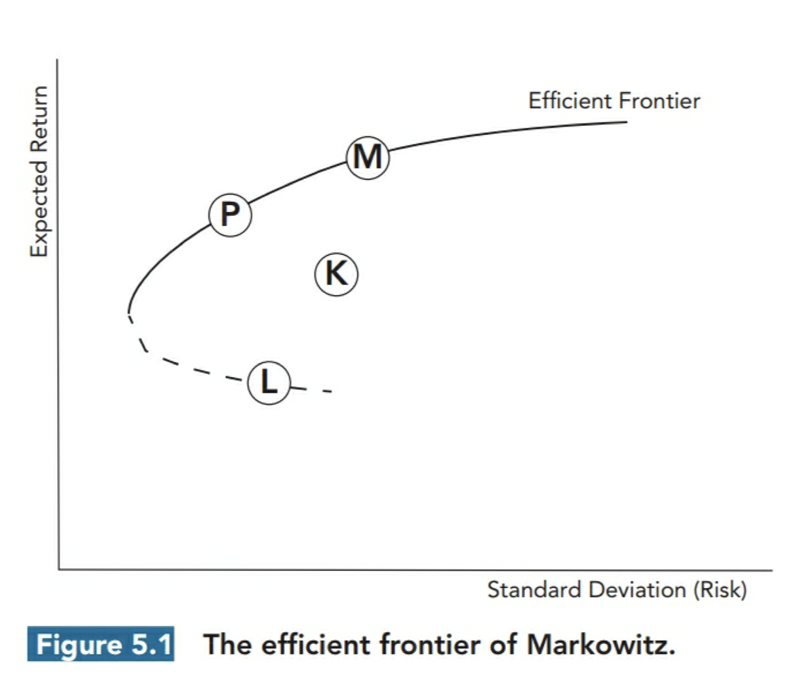

# Introduction of Risk Management

## The Building Blocks of Risk Management

**Risk**, in the most basic sense, is the probability that bad things might happen;

### Risk Typology


```
.
`-- Market Risk
  `-- Interest Rate Risk
  `-- Commodity Price Risk
  `-- Equity Risk
  `-- Currency Risk
`-- Operation Risk
  `-- Legal Risk
  `-- AML Risk
  `-- Cyber Risk
  `-- Model Risk
`-- Credit Risk
  `-- Bankrupcy Risk
  `-- Downgrade Risk
  `-- Counterparty Risk
`-- Business Risk
`-- Reputation Risk
`-- Liquidity Risk

```

### Credit Risk may increase if:
 - A less and large amount of loan instead of more and small amount of loan; 
 - The loans are highly positively correlated;
 - ~~Macroeconomics fall down~~ The exposure, loss given default and the probability of default are positively correlated;


### Liquidity Risk is used to describe two separate risks:
1. Funding Risk;
2. ~~Specific Market Liquidity Risk~~ Trading Liquidity Risk;

**Operation Risk** is the risk resulted from inadequate or failed internal processes, people, and systems or from external events;

### The Process of Risk Management:
1. Identify
2. Analyze
3. Assess Impact
4. Manage

### A series of choices to deal with the risks:
1. Avoid, change strategy to avoid potential risk;
2. Retain, according to firms' appetite, to achieve more reward.
3. Mitigate, diversifying the asset, or using derivatives to hedge positions;
4. Transfer, Eg. buying insurance. 

### 4 Risks(Known versus Unknowns):
1. Expected Loss;
2. Unexpected Loss;
3. Knightian Uncertainty(Known Unknowns Eg. Nuclear wars that can not be quantified);
4. Unknown Unknowns;

### Expected Loss can be calculated by:

EL = LGD(Loss Given Default) \* Probability of Default(PD) \* Explosure at Default(EAD)

### VaR: Value at Risk;
  - Firstly used by JP morgan to assess the amount of loss in a given level of confidence;
  - Fall down if the tail is fat;

### 3 Lines to defend large Unexpected Loss:

1. Business line risk management;
2. Risk management Committee;
3. Internal audit;

### Risk-adjusted return on capital(RAROC):
  - RAROC = Reaward / Risk
  - RAROC = After Tax Net Risk-Adjusted Expected Return / Economic Capital

### Risk Management RoadMap, 5 Milestones

1. Identify Risk Appetite;
2. Map risks;
3. Operationalize;
4. Implement;
5. ~~Day-to-day review~~ Re-evaluate everyday;

### What is the Risk Appetite? What is the Risk Capacity?

**Risk appetite** describes the amount and the type of risks which the firm is willing to take;

**Risk capacity** describes the maximum amount of risk which a firm can absorb;

### FRB(Federal Reserve Board) conduct 2 stress testing exercises:

1. Dot-Frank Act Stress Test for asset size larger than USD 10 billion;
2. Comprehensive Capital Analysis and Review for asset size larger than USD 50 billion;

### Most institutions set two types of limits:

1. Tier 1, risk that is specified, an overall limit by asset class;
2. Tier 2, more generalized risk-related areas of business activities;

## Modern portfolio theory
### Efficient frontier of Markowitz
Assumptions:
  1. Investors are all rational(risk-averse and want to maximize the utility);
  2. The market is perfectly efficient(no extra trading cost and all infomations are transparent to all investors);
  3. Returns are normally distributed;

The Markowitz efficient frontier demonstrates the portfolios in the capital market which is possible have the minimum variance with the same return; 



### Capital Asset Pricing Model

The assumptions of CAPM are inherited from Markowitz's efficient frontier:
1. Freely Access to the info by all investors;
2. No trading costs;
3. Allocation can be made in investment in any partial amount(perfect diversibility);
4. All investors can borrow or lend in Risk-free rate;
5. Any individual investor can not affect the market prices;

In CAPM, all portfolios are combined by risk-free investment and the portfolios on the efficient frontier, which is completely diversified.

### Security Market Line(SML)
The X-Axis is $$\beta$$, and the line describes the relation between expected return and the correlation of the market.

### The Equations between $$\beta$$, $$\rho$$ and Covariance

$$\beta_A = \dfrac{cov(A, B)}{\sigma_B^2} = \rho_{A,B} * \dfrac{\sigma_A}{\sigma_B}$$

### Performance Measurement

**Sharpe Ratio**:

$$SP = \dfrac{E(R) - E(f)}{\sigma_P}$$

SR is to measure the performance of the portfolios which are not well diversified.

**Treynor Ratio**:

$$TR = \dfrac{E(R)- E(f)}{\beta_P}$$

TR is to measure the performance of the portfolios which are well diversified, and to measure the return based on the \beta.

**Sortino Ratio**:

$$Sortino-Ratio = \dfrac{E(R) - MAR}{\sqrt{\dfrac{1}{N + 1}\displaystyle\sum_{t=1}^N}(R_t - MAR)^2} (R_{Pt} < MAR)$$

MAR: Minimum Acceptable Return
Sortino Ratio is widely used when the return distribution is left-skewed.


**Jensen's Alpha**

$$\alpha_P = E(R_P) - \beta_P * (E(M) - E(f)) - E(f)$$

Jensen's alpha can be used to compare the portfolios which have the same $$\beta$$. 

**Tracking Error**

$$TE = R(P) - R(B)$$

$$TE = \sigma(R(P) - R(B)) = \sqrt{\dfrac{\displaystyle\sum_{n=1}^N (R(P) - R(B))^2}{N - 1}}$$

**Information Ratio**

$$IR = \dfrac{E(R) - E(R_B)}{\sigma(E(R) - E(R_B))} = \dfrac{\alpha_P}{\sigma(\alpha_P)}$$

### Arbitrary Pricing Theory(APT)

Unlike the CAPM, the APT does not assume the investors invest on efficient portfolios. 
The APT has 3 underlying assumptions:
1. Specific Risk can be eliminated by diversification;
2. There are no arbitrary opportunity for the investors, if any, will soon disappear;
3. Asset returns can be explained by systematic factors;

The APT can be described as:
$$E(R) = R_f + \sum\beta_iF_i$$

### CAPM and APT

Actually, APT is more frequently preferred because CAPM is a special case of APT, as the market index is the only factor of its model. APT can include more factors not only the market index in its model. In addition, the calculation of correlation in CAPM is more complex(which needs $$N + \dfrac{N^2 - N}{2}$$ calculations), and the APT requires $$MN + \dfrac{M(M - 1)}{2}$$ calculations;

### Fama-French Three Factor Model

1. SMB: Small Minus Big;
2. HML: High Minus Low;
3. M: Market Base Line;

In 2016, Fama and French add two new factors: RMW(Robust Minus Weak) and CMA(Conservative Minus Aggressive), and with these two factors, Fama and French shows the HML factor is redundant then.

### Effective Data Aggregation and Risk Reporting

**Model Risk** can be decomposed into 4 components:
1. Input Risk;
2. Estimation Risk;
3. Valuation Risk;
4. Hedging Risk;

### 11 Principles:
* Data architecture and IT Infrastructure;
* Timeliness;
* Completeness;
* Frequency;
* Integrity;
* Adaptable;
* Governance;
* Accuracy and Integrity;
* Comprehensiveness;
* Distribution;
* Clarity and Usefulness;

