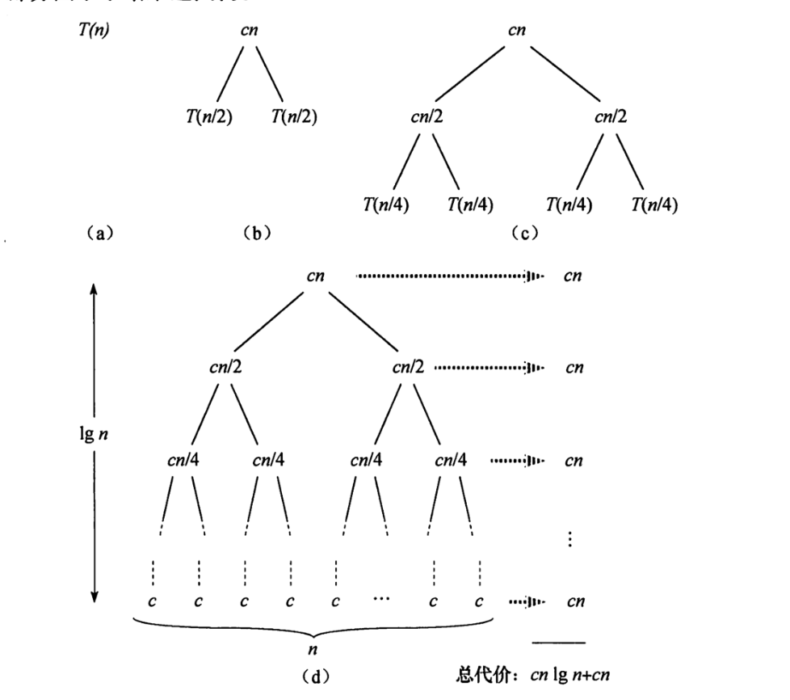

# 算法基础

### 排序算法 -- 插入排序

InsertionSort(A)
```
  for j = 2 to A.length
    key = A[j]
    i = j - 1
    while i > 0 and A[i] > key
      A[i + 1] = A[i]
      i = i - 1
    A[i] = key

```
假定时间开销为c，插入算法的总时间开销（n代表代码行号）：
$$
  T = c_1 * n + c_2 * (n - 1) + c_3 * (n - 1) + c_4 * \sum_{j=2}^nt_j + c_5 * \sum_{j=2}^n(t_j - 1) + c_6 * \sum_{j=2}^n(t_j - 1) + c_7 * (n - 1)
$$

那么，最好情况是：
$$
  \sum_{j=2}^nt_j = n - 1
$$
最坏情况是：
$$
  \sum_{j=2}^nt_j = \dfrac{n * (n + 1)}{2} - 1
$$

所以总开销就成了n的二次函数，可以用$$\Theta$$来表示，那么插入排序算法的算法复杂度可以表达成$$\Theta(n^2)$$；


### 排序算法 -- 合并排序

MergeSort(A, p, r)
```
if p < r
  q = (p + r) / 2
  MergeSort(A, p, q)
  MergeSort(A, q + 1, r)
  Merge(A, p, q, r)
```
Merge(A, p, q, r)
```
n1 = q - p + 1
n2 = r - q
L = new int[n1 + 1]
R = new int[n2 + 1]
for i1 from 0 to n1 - 1
  L[i1] = A[p + i1]
for i2 from 0 to n2 - 1
  R[i2] = A[q + i2]
L[i1] = MaxInt
R[i2] = MaxInt

i = 0
j = 0
for index from p to r
  if L[i] >= R[j]
    result[index] = R[j]
    j += 1
  else 
    result[index] = L[i]
    i += 1
```



对于合并排序，作为分治算法的一中，是把每个问题分解成2个子问题，从图中可以看出，一共会有logn次分解，每次分解有cn的开销，那么总开销可以近似为cn * logn，复杂度省略常数项，则复杂度为$$\Theta(n\lg n)$$。