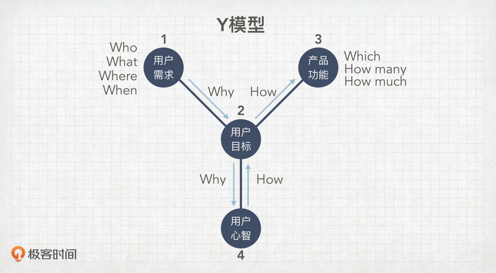

# 产品创新课 -- 苏杰

## 现行环境的困境（VUCA）

* Volatility
* Uncertainty
* Complexity
* Ambiguity

需求、技术发展迅速，产品的环境变化得也快，传统的瀑布模式难以匹配先产品所需的迭代速度。

## 四轮MVP框架和DS方法论

1. Paperwork - Discovery Sprint
2. Prototype - Design Sprint
3. Product - Develop Sprint
4. Promotion - Distribution Sprint

产品在一个周期中经历的4个阶段，4Ps，Minimum Valuable P， 对应四个Sprint。

## Paperwork

### 用户

*收集用户故事*

只有充分地了解用户，才能洞察用户的需求，所以需要在paperwork阶段收集尽可能多的用户故事。

*提炼用户生态*

基于用户故事，提炼出用户的生态，其中要注意颗粒度、边界和优先级。

*用户画像*

用户画像一般含有基本信息，与产品相关的特定信息以及相应的用户故事。

*用户旅程*

分析用户旅程，其实是产品一个升华的过程，是提升用户体验的一个非常有效的手段。

### 竞品

竞品分析包括两个维度：*方案* 和 *问题*。

一般有四种维度来区分两个竞品之间的关系：

* 同方案不同问题（虎扑和知乎）；
* 同问题不同方案（高铁和飞机）；
* 同问题同方案 （最典型的竞品关系，例如KFC和M记）；
* 不同问题不同方案 （占用了相同的公共资源）；

### Idea

怎么来筛选有价值的点子💡呢？四个层面，两个大层面：
内部层面：
* 能力 - 有没有充足的资源去实现这个点子；
* 意愿 - 跟现有的愿景和规划是否匹配；
外部层面：
* 价值 - 前景怎么样，是不是有很高的潜在价值；
* 成本 - 宏观环境和行业环境，上下游等的评估，是不是真的有利可图；

## Prototype

这是一个design的过程，需要去伪存真，快速、稳定地确定产品的原型。

### Y模型

这四个节点之间的分析是prototype中很重要的过程。

通过分析确定产品功能，而不是一味地听客户的。

在前一个阶段，用心听客户的需求，并消化成客户真正的目标。下一个阶段不需要照着做，而是找到租好的方法去达成用户目标。

### 借假修真

以最低的资源投入来验证产品的可行性，优化产品的功能；

1. 土耳其机器人

人工代替机器，在人工压力过大之后考虑功能的集成；

2. 酒店门童

有求必应 -> 提炼关键需求

3. 众筹

让客户用行动来验证产品的可行性，筹款、转发和赞等一系列用户互动行为都可以为产品服务；

4. 善意的谎言

宣传已开发了某产品来探测市场的反应；

5. 动物标本

模型话，没有真是功能，一般在于消费品比较多；

6. 乾坤大挪移

借用现存的产品，经过一些简单的包装，来探测客户的反馈；

7. 低配版本

做一些简单的低配版本来让用户使用以获得市场反馈，相比于真是产品的投入会少很多；

## Product

产品一般在导向上分为两种：实体导向和服务导向；

两个导向在各个层面都有差别：

1. 用户模式： 成交终止 -> 成交开始
2. 增长模式： 数量复制 -> 人尽其用
3. 财务模式： 当期收入 -> 预期收入

### 产品价值观

两个维度来评价一个产品的好坏：
1. 静态维度

有用 - 好用 - 爱用

三个程度可以提现一个产品的好坏；

2. 动态维度

*个体价值*：

产品提供给客户基本的功能，让客户更有效的工作/生活，产品处于活靶子阶段，很容易被抄袭和复制；

*个体粘性*：

产品提供了一系列的措施增加了客户的对产品的感情依赖，似的客户在选择同类产品时优先选择我们的产品，产品慢慢建立起自己的护城河。

*群体粘性*：

产品提供了一个价值网络，让用户本身成为用户选择的原因，产品相当于有了自己的增压器，获得了群体粘性。

*生态系统*：

用户因为产品而增长，产品可以催生新的物种，产品这个时候就变成了一个培养皿。

### 产品起步逻辑

1. 习惯
2. 启程
3. 发现
4. 精通

## Promotion

### 产品生命周期

1. 验证期
2. 爆发期
3. 平台期
4. 衰退期

衰退期到来时，就应该进行产品的迭代，让产品进入下一轮生命周期；

### 产品指标

指标应该符合SMART原则：

* S - Specific
* M - Measurable
* A - Accessable
* R - Related
* T - Time

真正成功的指标- 非受迫、无诱导的成功行为。

## Promotion

### 做出来，推出去

*降低做出来的成本*

1. 降低复制成本
2. 提供基础设施

*提升推出去的效率*

1. 消除时间、地点等销售传播的限制；
2. 数字化分销流程；
3. 提供基础设施，众包/外包分销过程；

### KANO模型

1. 亮点

针对客户爽点，一些超越基本功能的、提升客户使用体验的功能；

2. 基础功能

解决客户痛点，客户购买产品的根本的理由。

3. 期望功能

痒点，Nice to have，一些实打实可以满足用户对产品的期望的功能，例如手机的待电时间。

4. 无差别功能

无关痛痒的，一些可有可无的功能，better not。

5. 反向功能

越多用户越反感，例如百度的广告功能。

